# BlickTrack Backend - Code Architecture Diagram

## Complete System Architecture

This document provides a detailed technical overview of the BlickTrack Backend codebase architecture, showing how all implemented features work together.

## High-Level Architecture

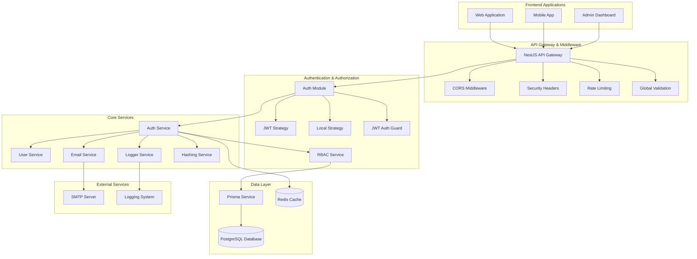

## Detailed Module Architecture

### 1. Authentication Module Structure

```mermaid
graph TB
    subgraph "Auth Module"
        AUTH_CONTROLLER[Auth Controller]
        AUTH_SERVICE[Auth Service]
        AUTH_SIMPLE[Auth Simple Service]
        
        subgraph "DTOs"
            REGISTER_DTO[Register DTO]
            LOGIN_DTO[Login DTO]
            REFRESH_DTO[Refresh Token DTO]
            VERIFY_DTO[Verify Email DTO]
            RESEND_DTO[Resend Verification DTO]
            FORGOT_DTO[Forgot Password DTO]
            RESET_DTO[Reset Password DTO]
            CHANGE_DTO[Change Password DTO]
        end
        
        subgraph "Guards"
            JWT_GUARD[JWT Auth Guard]
            LOCAL_GUARD[Local Auth Guard]
        end
        
        subgraph "Strategies"
            JWT_STRATEGY[JWT Strategy]
            LOCAL_STRATEGY[Local Strategy]
        end
    end
    
    subgraph "External Dependencies"
        JWT_SERVICE[JWT Service]
        EMAIL_SERVICE[Email Service]
        LOGGER_SERVICE[Logger Service]
        HASHING_SERVICE[Hashing Service]
        PRISMA_SERVICE[Prisma Service]
    end
    
    AUTH_CONTROLLER --> AUTH_SERVICE
    AUTH_CONTROLLER --> AUTH_SIMPLE
    AUTH_SERVICE --> JWT_SERVICE
    AUTH_SERVICE --> EMAIL_SERVICE
    AUTH_SERVICE --> LOGGER_SERVICE
    AUTH_SERVICE --> HASHING_SERVICE
    AUTH_SERVICE --> PRISMA_SERVICE
    
    AUTH_CONTROLLER --> REGISTER_DTO
    AUTH_CONTROLLER --> LOGIN_DTO
    AUTH_CONTROLLER --> REFRESH_DTO
    AUTH_CONTROLLER --> VERIFY_DTO
    AUTH_CONTROLLER --> RESEND_DTO
    AUTH_CONTROLLER --> FORGOT_DTO
    AUTH_CONTROLLER --> RESET_DTO
    AUTH_CONTROLLER --> CHANGE_DTO
    
    AUTH_CONTROLLER --> JWT_GUARD
    AUTH_CONTROLLER --> LOCAL_GUARD
    
    JWT_GUARD --> JWT_STRATEGY
    LOCAL_GUARD --> LOCAL_STRATEGY
```

### 2. Email Service Architecture

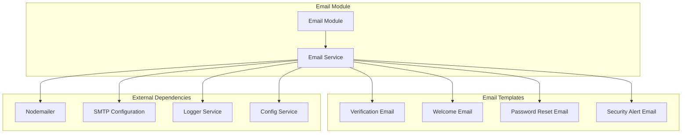

### 3. Logger Service Architecture

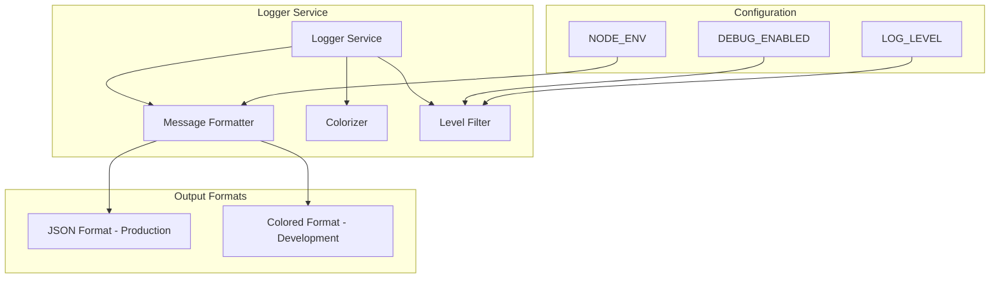

## Data Flow Diagrams

### 1. User Registration Flow

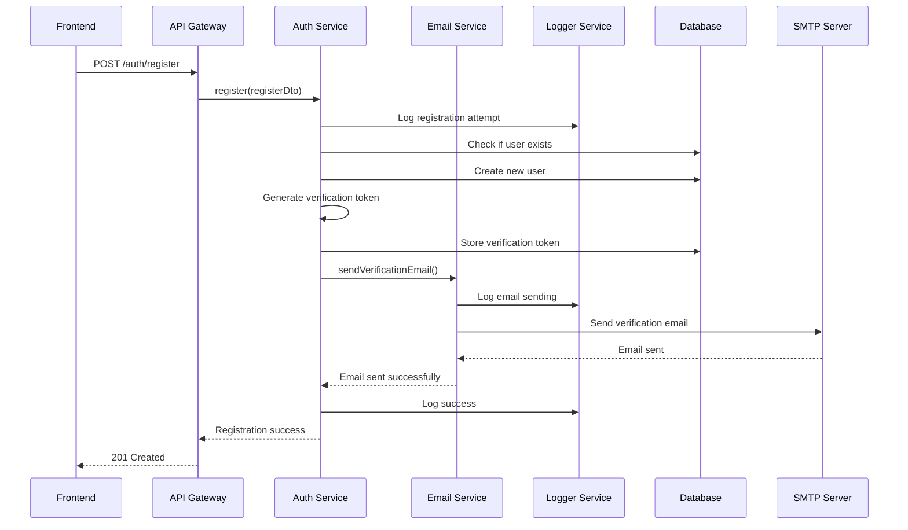

### 2. Login Flow with Token Management

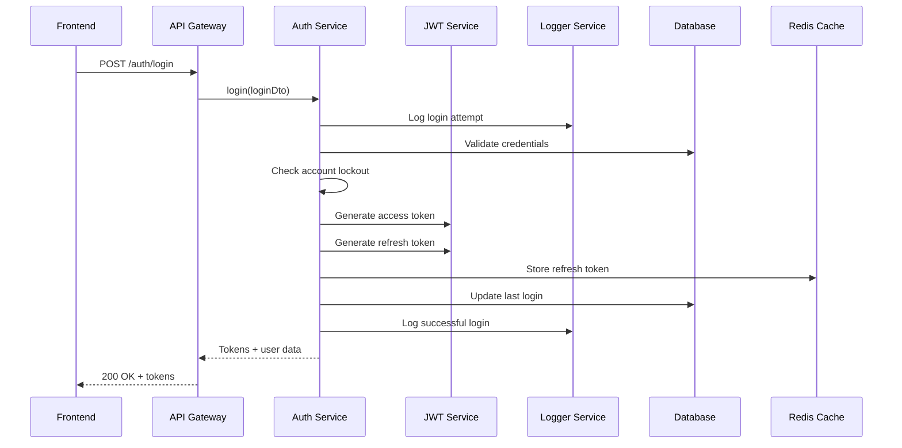

### 3. Token Refresh Flow

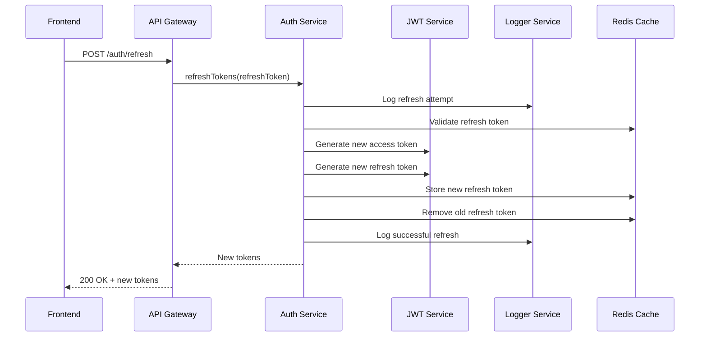

## Database Schema Relationships

### Core Authentication Tables

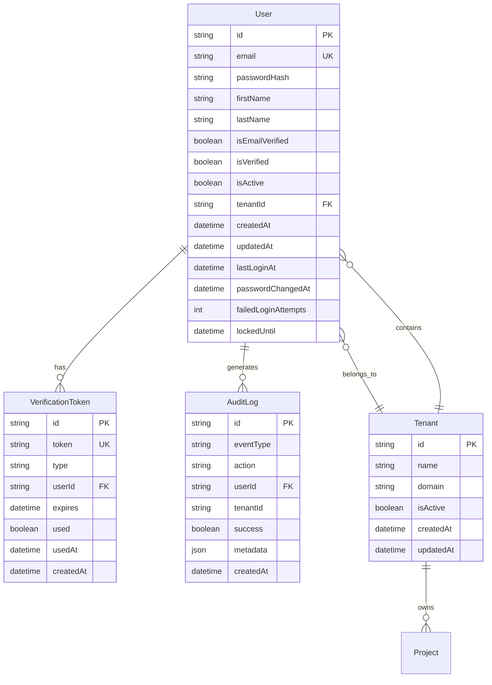

## Security Architecture

### 1. Multi-Layer Security

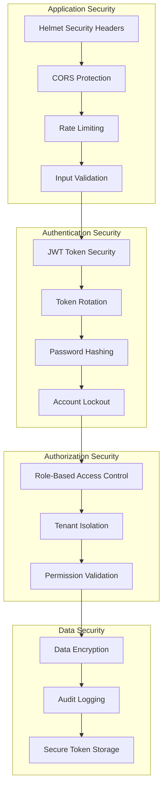

### 2. Token Security Flow

```mermaid
graph TB
    subgraph "Token Generation"
        LOGIN[User Login]
        VALIDATE[Validate Credentials]
        GENERATE_ACCESS[Generate Access Token]
        GENERATE_REFRESH[Generate Refresh Token]
        STORE_REFRESH[Store Refresh Token]
    end
    
    subgraph "Token Usage"
        REQUEST[API Request]
        EXTRACT[Extract Access Token]
        VALIDATE_TOKEN[Validate Token]
        ALLOW[Allow Request]
    end
    
    subgraph "Token Refresh"
        EXPIRED[Token Expired]
        REFRESH_REQUEST[Refresh Request]
        VALIDATE_REFRESH[Validate Refresh Token]
        ROTATE[Rotate Tokens]
        UPDATE[Update Stored Tokens]
    end
    
    LOGIN --> VALIDATE
    VALIDATE --> GENERATE_ACCESS
    GENERATE_ACCESS --> GENERATE_REFRESH
    GENERATE_REFRESH --> STORE_REFRESH
    
    REQUEST --> EXTRACT
    EXTRACT --> VALIDATE_TOKEN
    VALIDATE_TOKEN --> ALLOW
    
    EXPIRED --> REFRESH_REQUEST
    REFRESH_REQUEST --> VALIDATE_REFRESH
    VALIDATE_REFRESH --> ROTATE
    ROTATE --> UPDATE
```

## Error Handling Architecture

### 1. Error Flow

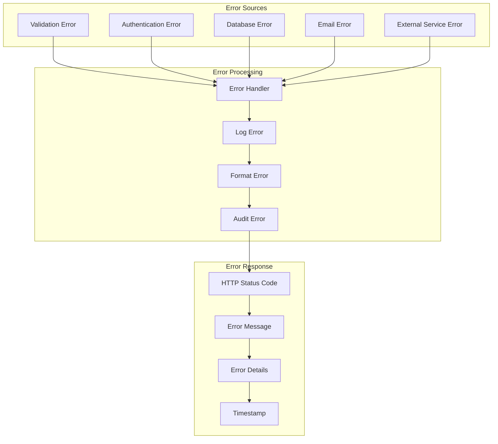

## Performance Architecture

### 1. Caching Strategy

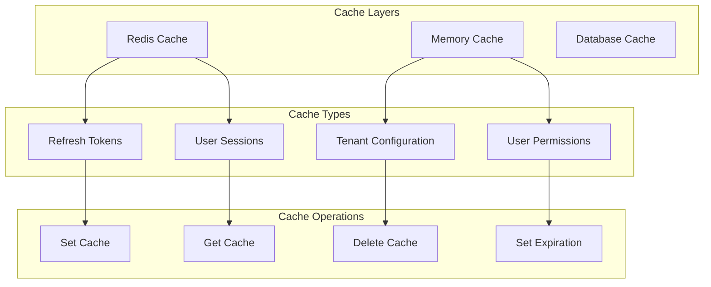

## Monitoring and Logging

### 1. Logging Architecture

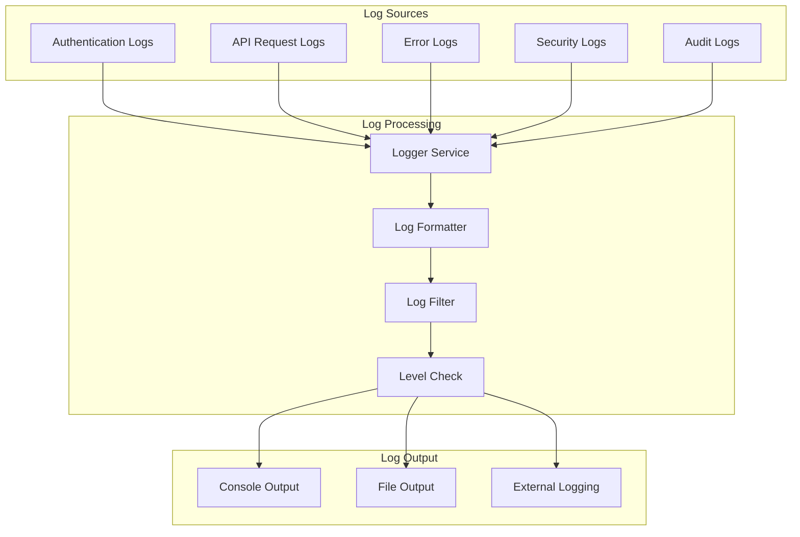

## Deployment Architecture

### 1. Production Deployment

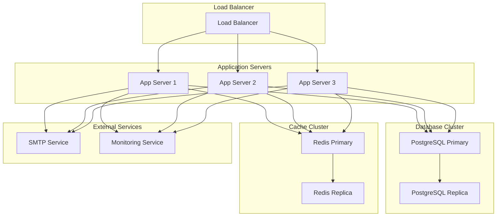

## Configuration Management

### 1. Environment Configuration

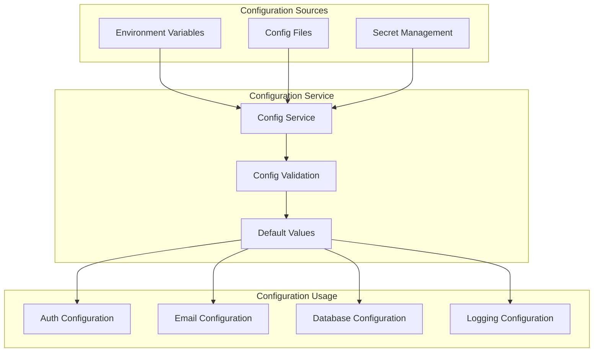

This comprehensive architecture diagram shows how all the implemented features work together in the BlickTrack Backend system, providing a complete technical overview for frontend developers and system architects.
