# BlickTrack Backend - Complete Code Flow Diagrams

## Overview
This document provides comprehensive flow diagrams showing when each page, code, and function is hit in the BlickTrack Backend API. It includes detailed call flows, request/response patterns, and system interactions.

## Table of Contents
1. [Main Application Flow](#main-application-flow)
2. [Authentication Flow](#authentication-flow)
3. [Tenant Management Flow](#tenant-management-flow)
4. [User Management Flow](#user-management-flow)
5. [Dashboard Flow](#dashboard-flow)
6. [Admin Operations Flow](#admin-operations-flow)
7. [API Request Flow](#api-request-flow)
8. [Error Handling Flow](#error-handling-flow)

---

## Main Application Flow

### Application Startup Sequence
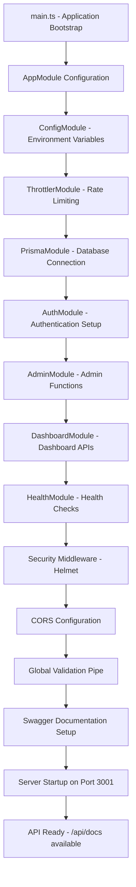

### Request Processing Flow
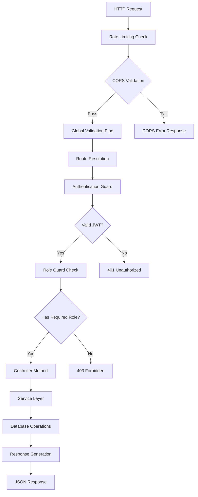

---

## Authentication Flow

### User Registration Flow
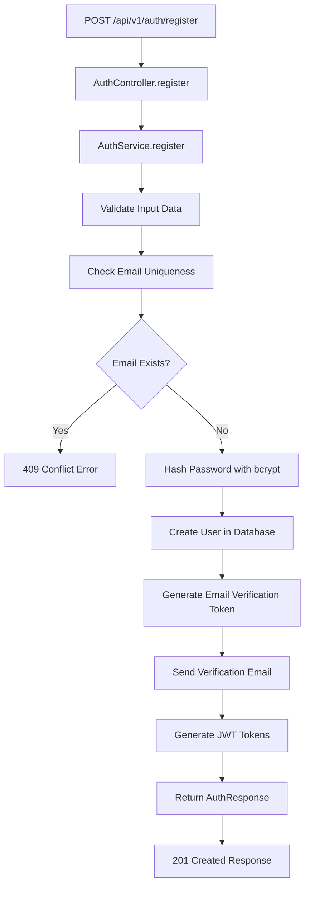

### User Login Flow
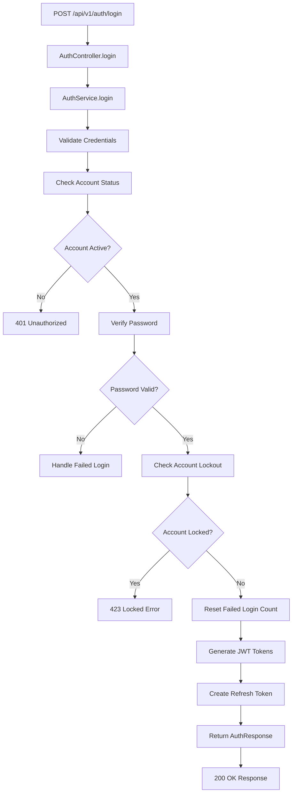

### Password Reset Flow
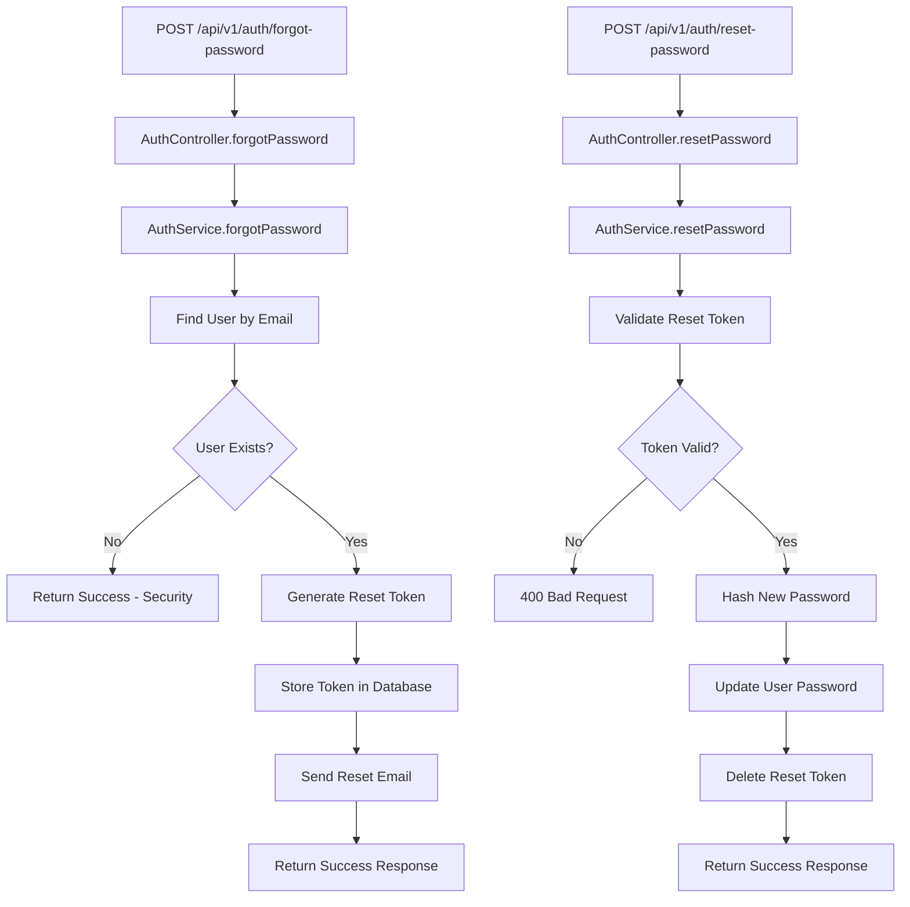

---

## Tenant Management Flow

### Tenant Creation Flow
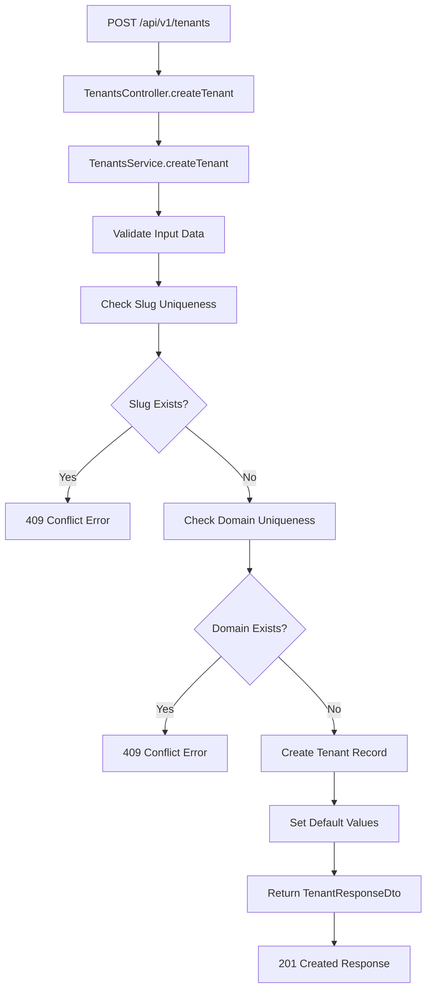

### Tenant Configuration Flow
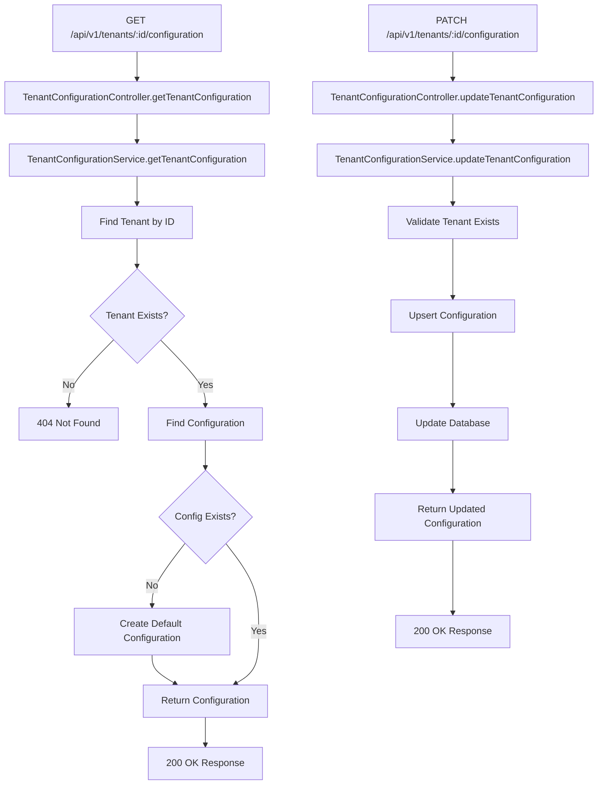

---

## User Management Flow

### User Creation Flow
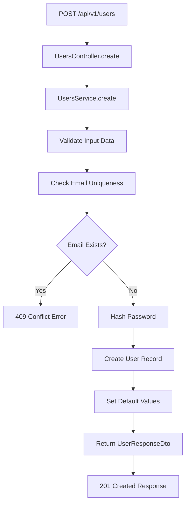

### User Listing Flow
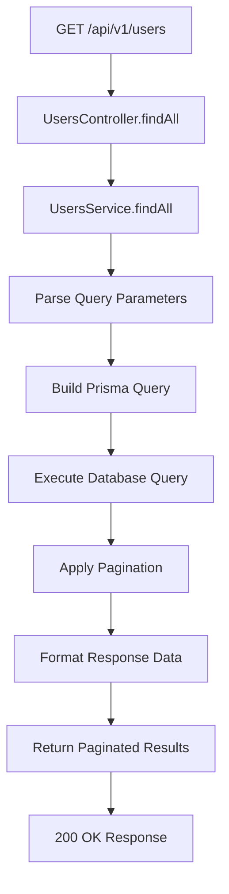

---

## Dashboard Flow

### Dashboard Statistics Flow
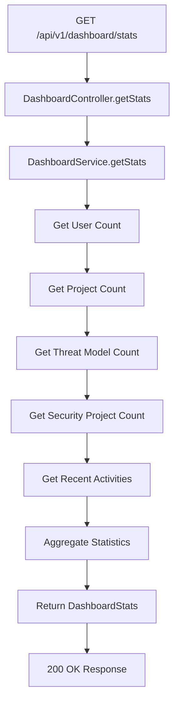

### Activity Feed Flow
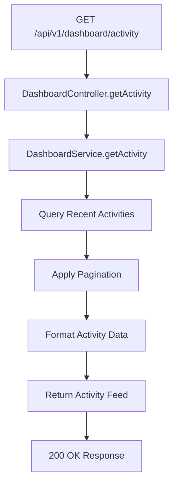

---

## Admin Operations Flow

### Platform Admin Flow
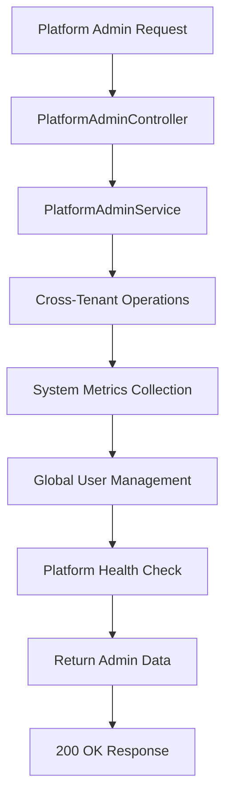

### Tenant Admin Flow
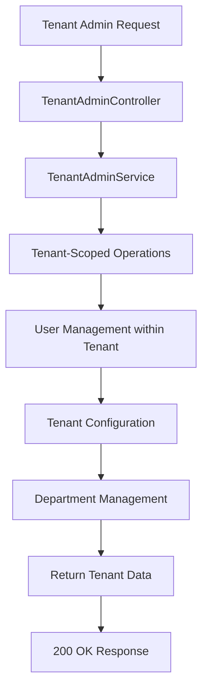

---

## API Request Flow

### Complete Request Lifecycle
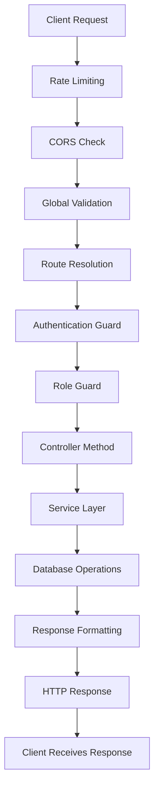

### Error Handling Flow
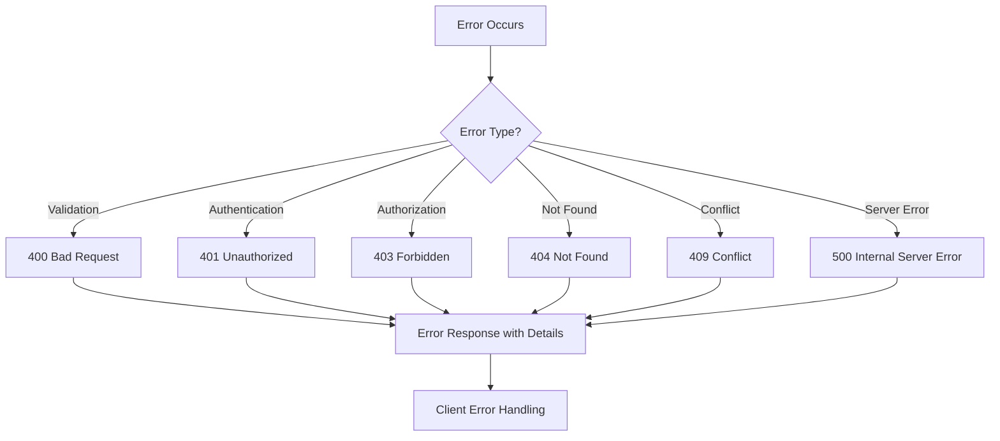

---

## File Structure and Responsibilities

### Core Files
- **main.ts**: Application bootstrap and configuration
- **app.module.ts**: Root module configuration
- **app.controller.ts**: System health and info endpoints
- **app.service.ts**: Core application services

### Authentication Files
- **auth.controller.ts**: Authentication endpoints
- **auth.service.ts**: Authentication business logic
- **jwt.strategy.ts**: JWT authentication strategy
- **local.strategy.ts**: Local authentication strategy

### Tenant Management Files
- **tenants.controller.ts**: Tenant CRUD operations
- **tenants.service.ts**: Tenant business logic
- **tenant-configuration.controller.ts**: Configuration management
- **tenant-configuration.service.ts**: Configuration business logic

### User Management Files
- **users.controller.ts**: User CRUD operations
- **users.service.ts**: User business logic
- **user-permissions.service.ts**: Permission management
- **external-collaborator.service.ts**: External user management

### Admin Files
- **platform-admin.controller.ts**: Platform administration
- **platform-admin.service.ts**: Platform admin business logic
- **tenant-admin.controller.ts**: Tenant administration
- **tenant-admin.service.ts**: Tenant admin business logic

### Dashboard Files
- **dashboard.controller.ts**: Dashboard endpoints
- **dashboard.service.ts**: Dashboard business logic

### Common Files
- **logger.service.ts**: Centralized logging
- **email.service.ts**: Email functionality
- **prisma.service.ts**: Database operations
- **rbac.service.ts**: Role-based access control

---

## When Each Function is Called

### Authentication Functions
- **register()**: Called when user creates new account
- **login()**: Called when user authenticates
- **logout()**: Called when user logs out
- **forgotPassword()**: Called when user requests password reset
- **resetPassword()**: Called when user resets password with token
- **verifyEmail()**: Called when user verifies email address

### Tenant Functions
- **createTenant()**: Called when platform admin creates new tenant
- **getTenants()**: Called when listing all tenants
- **getTenantById()**: Called when retrieving specific tenant
- **updateTenant()**: Called when updating tenant information
- **deleteTenant()**: Called when soft-deleting tenant
- **getTenantStats()**: Called when retrieving tenant statistics

### User Functions
- **create()**: Called when creating new user
- **findAll()**: Called when listing users
- **findOne()**: Called when retrieving specific user
- **update()**: Called when updating user information
- **remove()**: Called when deleting user

### Dashboard Functions
- **getStats()**: Called when loading dashboard statistics
- **getActivity()**: Called when loading activity feed
- **getProjects()**: Called when loading project data
- **getSystemHealth()**: Called when checking system health

---

## Security Flow

### JWT Token Validation
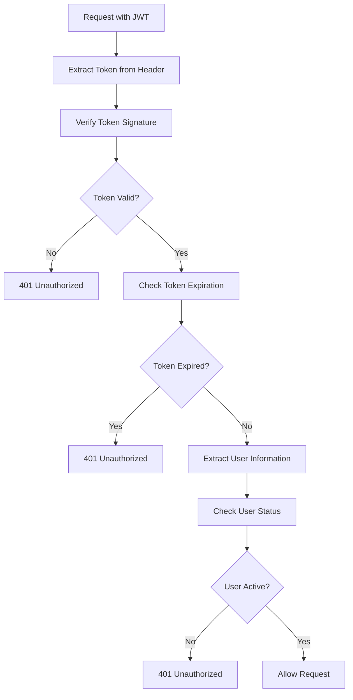

### Role-Based Access Control
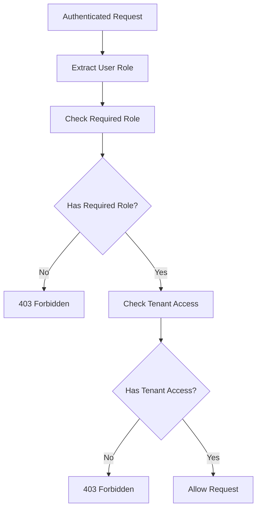

---

## Database Operations Flow

### Prisma Service Usage
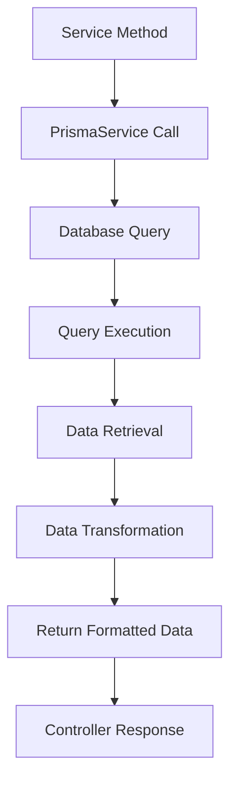

---

This comprehensive flow diagram documentation shows exactly when each function, controller, and service is called in the BlickTrack Backend API, providing a complete understanding of the system's operation and data flow.
