# BlickTrack Backend - Main Application Flow Diagram

## Complete System Flow Visualization

This document provides visual flow diagrams showing the complete application flow, request processing, and system interactions in the BlickTrack Backend API.

---

## 1. Application Startup Flow

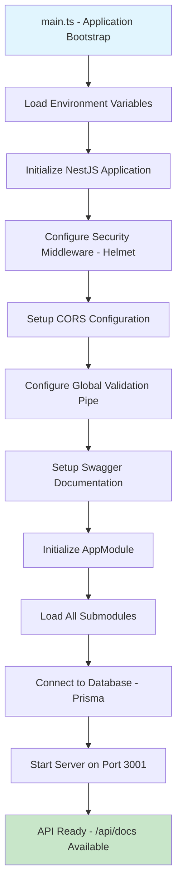

---

## 2. HTTP Request Processing Flow

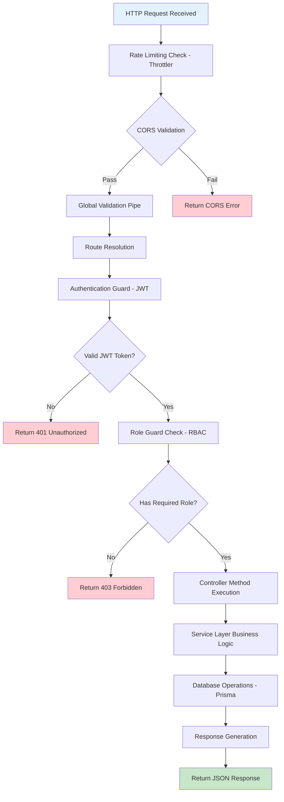

---

## 3. Authentication Flow

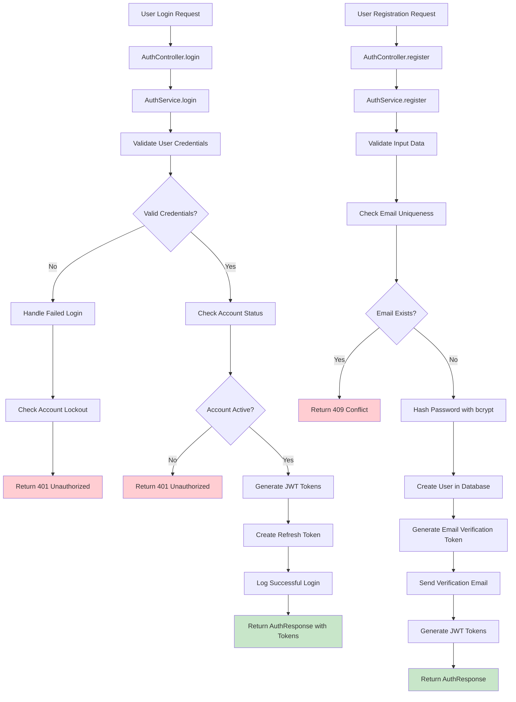

---

## 4. Tenant Management Flow

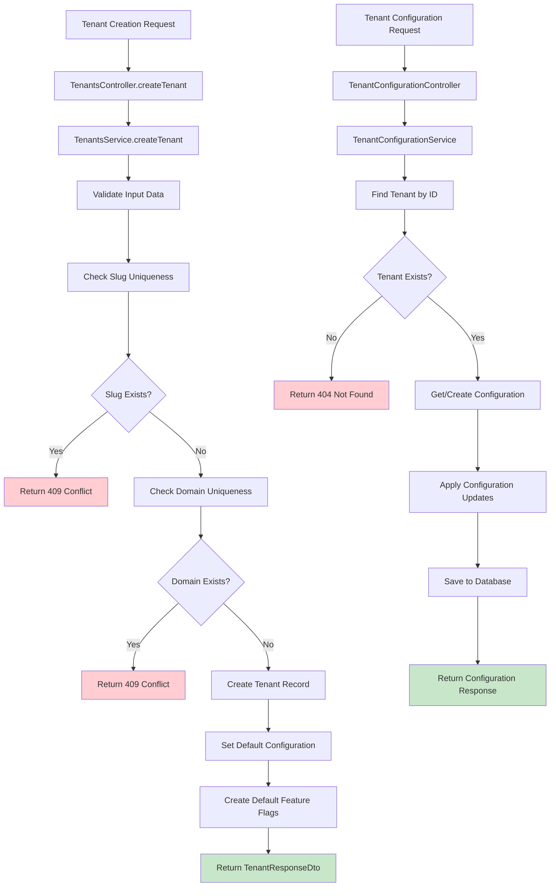

---

## 5. User Management Flow

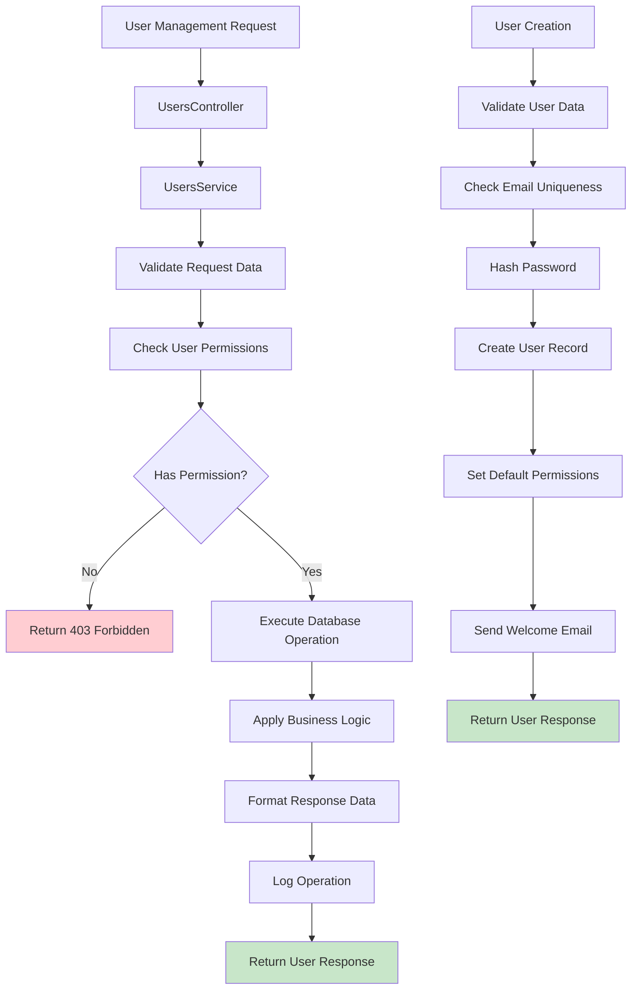

---

## 6. Dashboard Data Flow

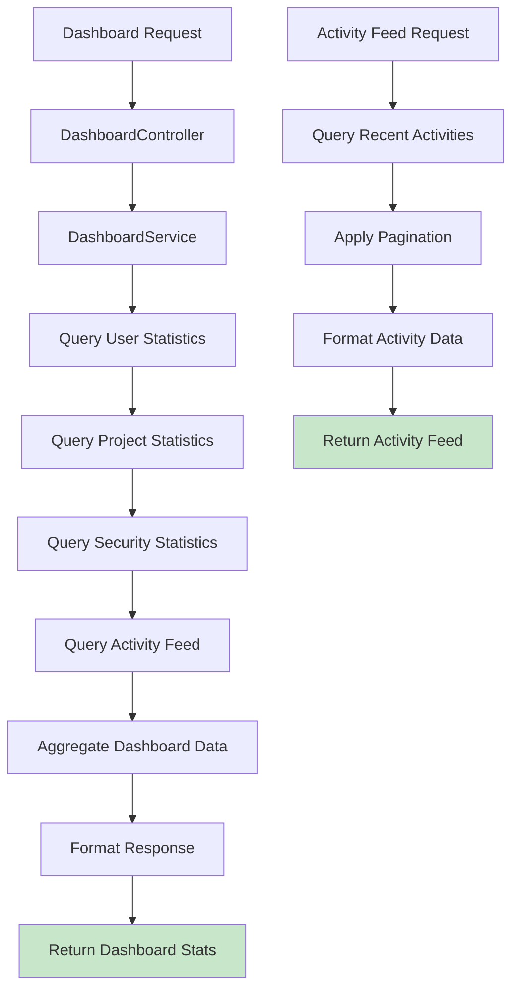

---

## 7. Admin Operations Flow

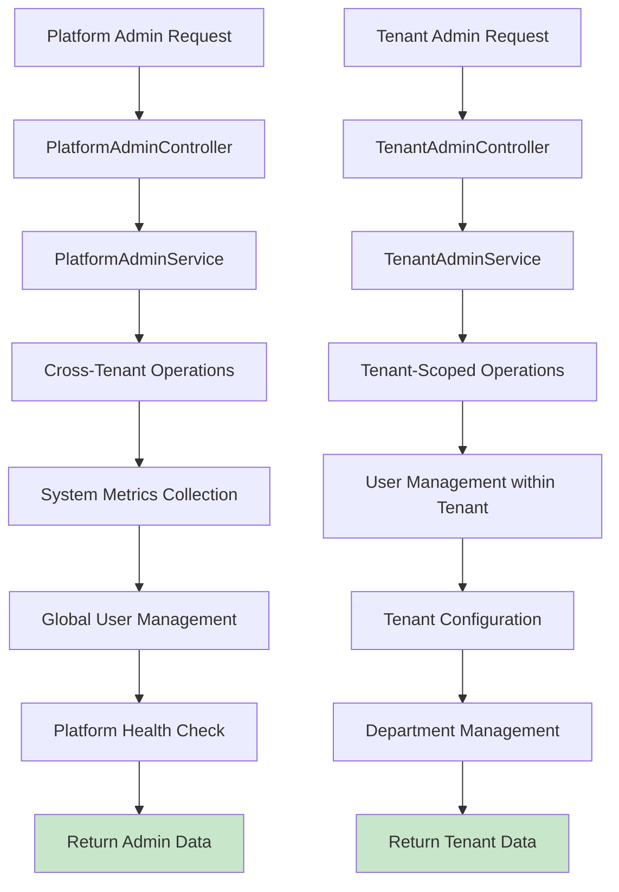

---

## 8. Database Operations Flow

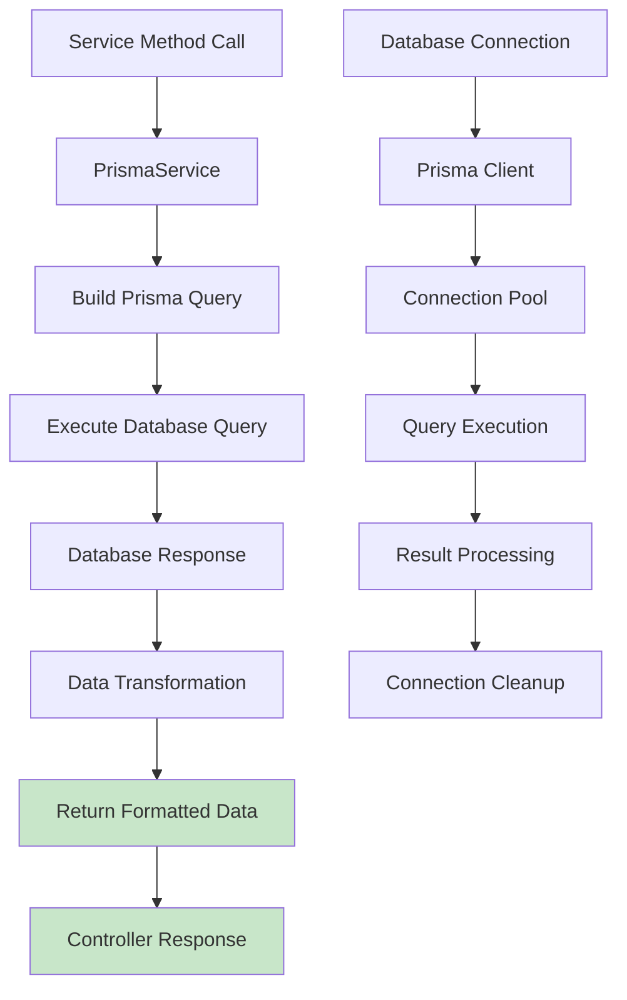

---

## 9. Error Handling Flow

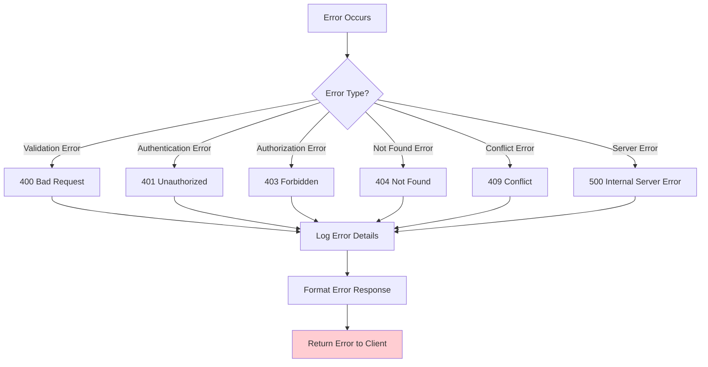

---

## 10. Email Service Flow

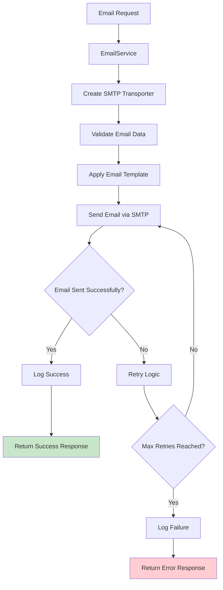

---

## 11. Logging Flow

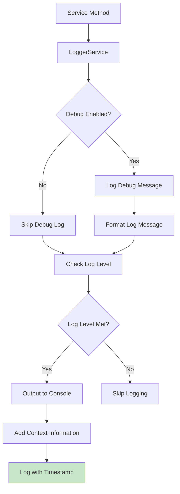

---

## 12. Multi-Tenant Data Flow

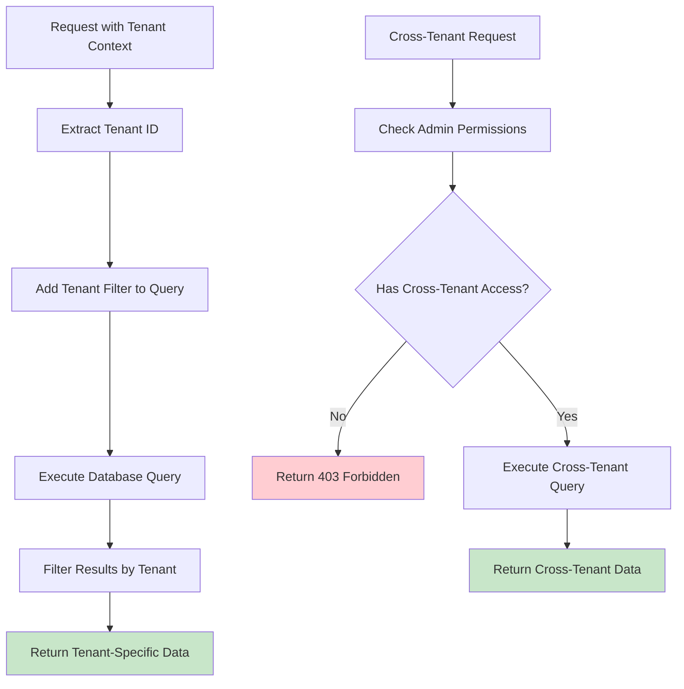

---

## 13. Security Flow

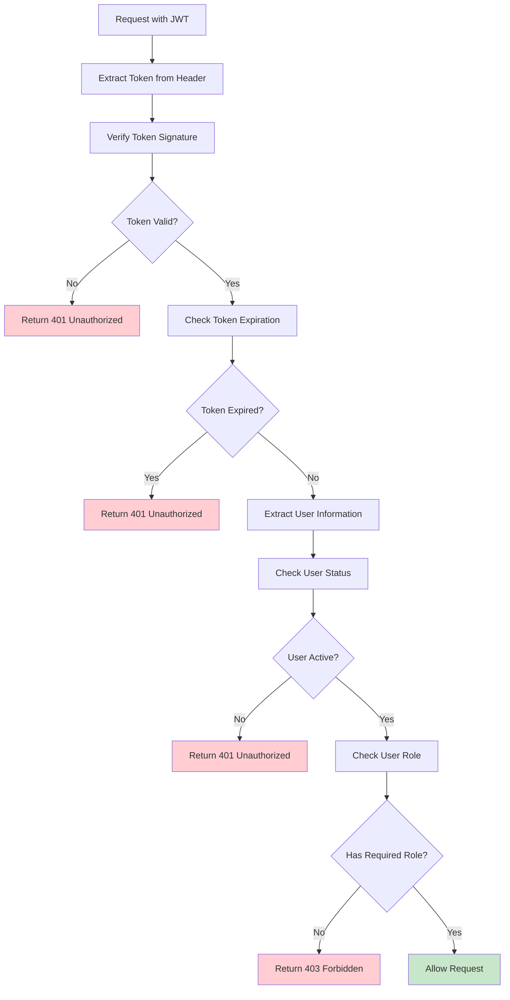

---

## 14. Complete Request Lifecycle

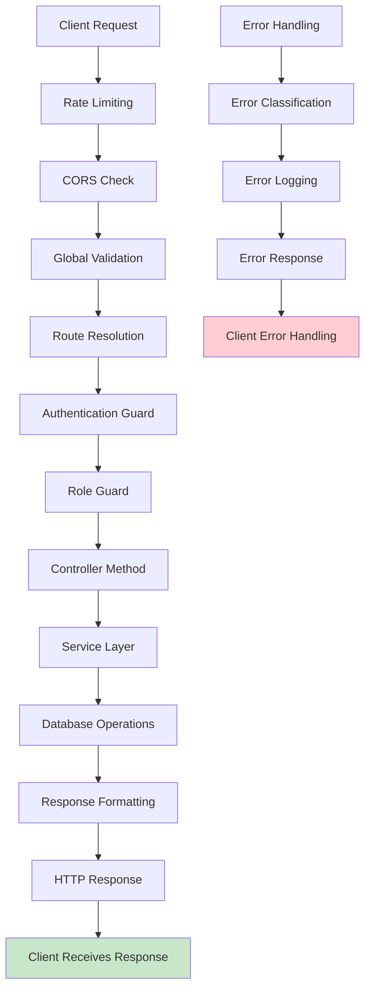

---

## Key Flow Patterns

### 1. **Request Processing Pattern**
- Rate Limiting → CORS → Validation → Authentication → Authorization → Controller → Service → Database → Response

### 2. **Authentication Pattern**
- Credentials → Validation → Token Generation → Response

### 3. **Database Pattern**
- Service Method → Prisma Query → Database → Data Transformation → Response

### 4. **Error Handling Pattern**
- Error Occurrence → Classification → Logging → Response Formatting → Client Notification

### 5. **Multi-Tenant Pattern**
- Request → Tenant Extraction → Tenant Filtering → Tenant-Specific Data → Response

### 6. **Admin Pattern**
- Admin Request → Permission Check → Cross-Tenant Operations → Admin Data → Response

---

This comprehensive flow diagram documentation shows exactly how the BlickTrack Backend API processes requests, handles authentication, manages data, and provides responses. Each flow is color-coded for easy understanding and includes error handling paths.
