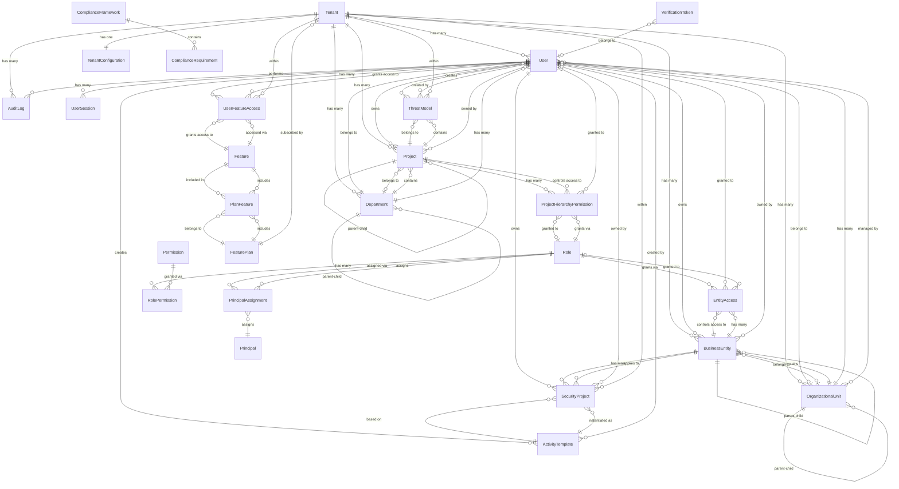
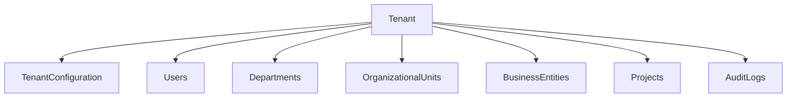
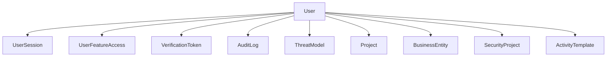
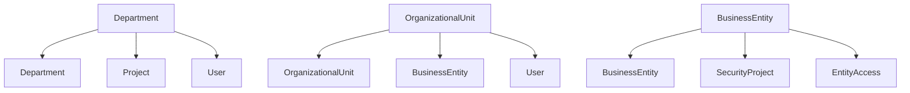
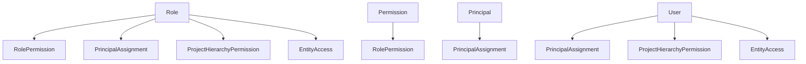
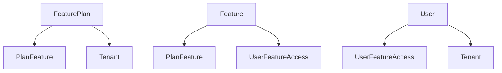
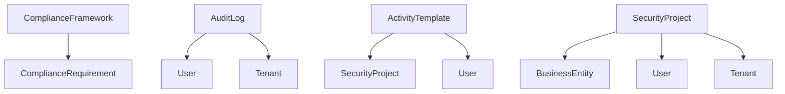

# BlickTrack Prisma Schema Visual Diagram

**Database Relationship Diagram for Enterprise Cybersecurity Platform**

This document provides a visual representation of the BlickTrack database schema relationships using Mermaid diagrams.

## Complete Database Schema Diagram



## Core Architecture Layers

### Layer 1: Tenant and Configuration


### Layer 2: User Management and Authentication


### Layer 3: Organizational Structure


### Layer 4: Security and Access Control


### Layer 5: Feature Licensing


### Layer 6: Compliance and Audit


## Key Relationship Patterns

### 1. Multi-Tenant Isolation
Every major entity is connected to a Tenant, ensuring complete data isolation:
- Tenant → Users, Projects, Departments, etc.
- All queries are automatically scoped to the current tenant

### 2. Hierarchical Structures
Several entities support self-referencing hierarchies:
- Department → Department (parent-child)
- OrganizationalUnit → OrganizationalUnit (parent-child)
- BusinessEntity → BusinessEntity (parent-child)
- Project → Project (parent-child)

### 3. Access Control Patterns
Multiple access control mechanisms work together:
- Role → Permission (RBAC)
- User → Role (via PrincipalAssignment)
- User → Feature (via UserFeatureAccess)
- User → Project (via ProjectHierarchyPermission)
- User → BusinessEntity (via EntityAccess)

### 4. Audit and Compliance
Comprehensive audit trail:
- Every action is logged in AuditLog
- All entities are connected to their creators
- Compliance frameworks provide structure for requirements

## Data Flow Patterns

### 1. User Authentication and Authorization
```
User → UserSession → Role → Permission → Resource Access
```

### 2. Feature Access Control
```
User → UserFeatureAccess → Feature → PlanFeature → FeaturePlan
```

### 3. Project Management
```
User → Project → ProjectHierarchyPermission → Access Control
```

### 4. Business Entity Management
```
User → BusinessEntity → EntityAccess → Access Control
```

### 5. Security Activity Execution
```
User → ActivityTemplate → SecurityProject → BusinessEntity → Results
```

This diagram shows the comprehensive relationships between all database tables, demonstrating how the BlickTrack platform supports enterprise-grade cybersecurity management with multi-tenant architecture, hierarchical organization, advanced access control, and comprehensive audit capabilities.
