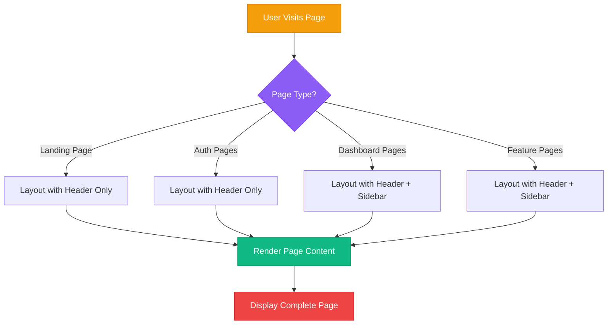
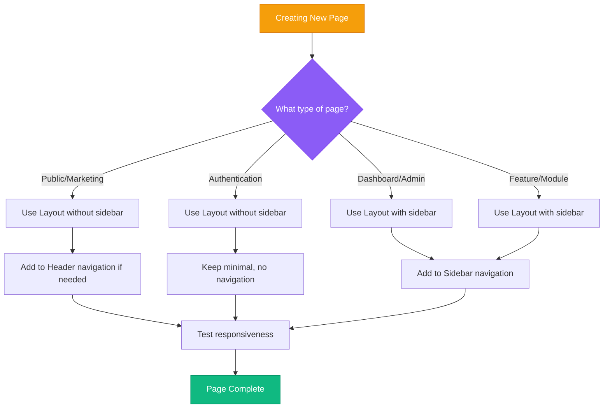

# 🏗️ BlickTrack Frontend Architecture - Reusable Components Guide

**Date**: January 27, 2025  
**Version**: 1.0  
**Author**: BlickTrack Development Team  

---

## 📋 Table of Contents

1. [Overview](#overview)
2. [Architecture Diagram](#architecture-diagram)
3. [Component Structure](#component-structure)
4. [How It Works](#how-it-works)
5. [Component Details](#component-details)
6. [Adding New Pages](#adding-new-pages)
7. [Best Practices](#best-practices)
8. [Troubleshooting](#troubleshooting)

---

## 🎯 Overview

The BlickTrack frontend uses a **reusable component architecture** that ensures consistent design, branding, and user experience across all pages. This approach eliminates code duplication, simplifies maintenance, and provides a professional enterprise-grade appearance.

### 🎨 Key Benefits:
- ✅ **Consistent Branding** - Same header, logo, and styling everywhere
- ✅ **No Code Duplication** - Single source of truth for layout components
- ✅ **Easy Maintenance** - Update once, changes everywhere
- ✅ **Professional Look** - Enterprise-grade design consistency
- ✅ **Mobile Responsive** - Works perfectly on all devices
- ✅ **Scalable Architecture** - Easy to add new pages and features

---

## 🏗️ Architecture Diagram

### **Component Hierarchy**
```
┌─────────────────────────────────────────────────────────────┐
│                    Layout Component                         │
│  ┌─────────────────┐  ┌─────────────────┐  ┌─────────────┐ │
│  │  Header         │  │  Sidebar        │  │  Page       │ │
│  │  Component      │  │  Component      │  │  Content    │ │
│  │                 │  │                 │  │             │ │
│  │ ┌─────────────┐ │  │ ┌─────────────┐ │  │ ┌─────────┐ │ │
│  │ │   Logo      │ │  │ │ Navigation  │ │  │ │ Landing │ │ │
│  │ │   Branding  │ │  │ │ Menu        │ │  │ │ Page    │ │ │
│  │ └─────────────┘ │  │ └─────────────┘ │  │ └─────────┘ │ │
│  │                 │  │                 │  │             │ │
│  │ ┌─────────────┐ │  │ ┌─────────────┐ │  │ ┌─────────┐ │ │
│  │ │   Search    │ │  │ │ Collapsible │ │  │ │Dashboard│ │ │
│  │ │   Bar       │ │  │ │ Sections    │ │  │ │ Page    │ │ │
│  │ └─────────────┘ │  │ └─────────────┘ │  │ └─────────┘ │ │
│  │                 │  │                 │  │             │ │
│  │ ┌─────────────┐ │  │ ┌─────────────┐ │  │ ┌─────────┐ │ │
│  │ │ Notifications│ │  │ │ Role-based  │ │  │ │ Auth    │ │ │
│  │ │ Profile     │ │  │ │ Items       │ │  │ │ Pages   │ │ │
│  │ └─────────────┘ │  │ └─────────────┘ │  │ └─────────┘ │ │
│  └─────────────────┘  └─────────────────┘  └─────────────┘ │
└─────────────────────────────────────────────────────────────┘
```

### **Responsive Layout**
```
Desktop (1024px+):
┌─────────────────────────────────────────────────────────────┐
│                        Header                               │
├─────────────┬───────────────────────────────────────────────┤
│             │                                               │
│   Sidebar   │              Page Content                     │
│             │                                               │
│             │                                               │
│             │                                               │
└─────────────┴───────────────────────────────────────────────┘

Mobile (<1024px):
┌─────────────────────────────────────────────────────────────┐
│                        Header                               │
│                    [Menu Toggle]                            │
├─────────────────────────────────────────────────────────────┤
│                                                             │
│                    Page Content                             │
│                                                             │
│                                                             │
│                                                             │
└─────────────────────────────────────────────────────────────┘

Mobile Sidebar (when toggled):
┌─────────────────────────────────────────────────────────────┐
│                        Header                               │
├─────────────┬───────────────────────────────────────────────┤
│             │                                               │
│   Sidebar   │              Page Content                     │
│   (Overlay) │              (Dimmed)                         │
│             │                                               │
│             │                                               │
└─────────────┴───────────────────────────────────────────────┘
```

---

## 📁 Component Structure

```
blicktrack-frontend/
├── components/
│   └── layout/
│       ├── Layout.tsx          # Main layout wrapper
│       ├── Header.tsx          # Navigation header
│       └── Sidebar.tsx         # Navigation sidebar
├── app/
│   ├── page.tsx               # Landing page
│   ├── dashboard/
│   │   └── page.tsx           # Dashboard page
│   └── auth/
│       ├── login/
│       │   └── page.tsx       # Login page
│       └── signup/
│           └── page.tsx       # Signup page
```

---

## 🔄 How It Works

### 📊 Flow Diagram



### 🎯 Layout Detection Logic

```typescript
// Layout.tsx automatically detects page type
const isAuthPage = pathname.startsWith('/auth');
const isLandingPage = pathname === '/';

if (isLandingPage || isAuthPage) {
  // Show header only (no sidebar)
  return <Header showSidebar={false} />;
} else {
  // Show header + sidebar for dashboard/feature pages
  return (
    <Header showSidebar={true} />
    <Sidebar />
  );
}
```

---

## 🧩 Component Details

### 1. 🎯 Layout Component (`Layout.tsx`)

**Purpose**: Main wrapper that orchestrates the entire page layout

**Features**:
- 🔍 **Auto-detects** page type (auth, landing, dashboard)
- 📱 **Responsive design** for mobile and desktop
- 🎨 **Consistent spacing** and structure
- ⚡ **Performance optimized** with conditional rendering

```typescript
interface LayoutProps {
  children: ReactNode;      // Page content
  showSidebar?: boolean;    // Force sidebar visibility
}

// Usage Examples:
<Layout>                    // Auto-detects page type
<Layout showSidebar={true}> // Force sidebar on
<Layout showSidebar={false}> // Force sidebar off
```

**Responsive Behavior**:
- **Desktop (lg+)**: Fixed sidebar, main content adjusts
- **Mobile (<lg)**: Collapsible sidebar with overlay

### 2. 🎯 Header Component (`Header.tsx`)

**Purpose**: Provides consistent navigation and branding across all pages

**Features**:
- 🏢 **BlickTrack branding** with logo and company name
- 🔍 **Search functionality** (dashboard pages only)
- 🔔 **Notifications** with badge indicators
- ⚙️ **Settings** and user profile management
- 📱 **Mobile hamburger menu** for sidebar toggle

```typescript
interface HeaderProps {
  showSidebar?: boolean;    // Show/hide sidebar toggle
}
```

**Elements**:
- **Left**: Logo + Company name + Menu toggle (mobile)
- **Center**: Search bar (dashboard pages only)
- **Right**: Notifications + Settings + User profile dropdown

### 3. 🎯 Sidebar Component (`Sidebar.tsx`)

**Purpose**: Provides navigation menu for dashboard and feature pages

**Features**:
- 📋 **Hierarchical navigation** with collapsible sections
- 🎯 **Active page highlighting** with visual indicators
- 🏷️ **Badge notifications** for alerts and updates
- 📱 **Mobile responsive** with overlay design
- 🔐 **Role-based navigation** (ready for future enhancement)

```typescript
// Navigation structure
const navigation = [
  {
    name: 'Dashboard',
    href: '/dashboard',
    icon: <LayoutDashboard />,
  },
  {
    name: 'User Management',
    href: '/users',
    icon: <Users />,
    children: [
      { name: 'All Users', href: '/users' },
      { name: 'User Roles', href: '/users/roles' },
      { name: 'Permissions', href: '/users/permissions' },
    ]
  },
  // ... more sections
];
```

---

## ➕ Adding New Pages

### 📋 Step-by-Step Guide

#### **Step 1: Create Page File**
```bash
# Navigate to app directory
cd app

# Create new page directory
mkdir feature-name
cd feature-name

# Create page.tsx
touch page.tsx
```

#### **Step 2: Choose Layout Type**

**For Dashboard/Feature Pages** (with sidebar):
```typescript
'use client';
import Layout from '@/components/layout/Layout';

export default function FeaturePage() {
  return (
    <Layout showSidebar={true}>
      <div className="px-6 py-8">
        <h1 className="text-2xl font-bold mb-4">Feature Page</h1>
        {/* Your page content here */}
      </div>
    </Layout>
  );
}
```

**For Auth Pages** (header only):
```typescript
'use client';
import Layout from '@/components/layout/Layout';

export default function AuthPage() {
  return (
    <Layout>
      <div className="min-h-screen flex items-center justify-center">
        {/* Your auth form here */}
      </div>
    </Layout>
  );
}
```

**For Landing/Marketing Pages** (header only):
```typescript
import Layout from '@/components/layout/Layout';

export default function LandingPage() {
  return (
    <Layout>
      <div className="min-h-screen">
        {/* Your landing page content */}
      </div>
    </Layout>
  );
}
```

#### **Step 3: Add Navigation (Optional)**

If your page needs to appear in the sidebar:

1. **Edit** `components/layout/Sidebar.tsx`
2. **Add** your page to the navigation array:

```typescript
const navigation = [
  // ... existing items
  {
    name: 'Your Feature',
    href: '/your-feature',
    icon: <YourIcon className="w-5 h-5" />,
    children: [
      { name: 'Overview', href: '/your-feature' },
      { name: 'Settings', href: '/your-feature/settings' },
    ]
  }
];
```

#### **Step 4: Test Your Page**

```bash
# Start development server
npm run dev

# Visit your page
http://localhost:3000/your-feature
```

### 📊 Page Type Decision Tree



---

## 🎨 Best Practices

### ✅ **DO's**

1. **Always use Layout component** for consistent structure
2. **Choose appropriate layout type** (sidebar vs no sidebar)
3. **Follow naming conventions** for page files
4. **Test on mobile devices** for responsiveness
5. **Use semantic HTML** for accessibility
6. **Keep page content focused** and organized

### ❌ **DON'Ts**

1. **Don't create custom headers** - use the Layout component
2. **Don't duplicate navigation** - use Sidebar component
3. **Don't hardcode styling** - use Tailwind classes
4. **Don't forget mobile responsiveness** - test all breakpoints
5. **Don't skip accessibility** - use proper ARIA labels

### 🎯 **File Naming Conventions**

```
app/
├── dashboard/           # Dashboard pages
│   └── page.tsx
├── users/              # User management
│   ├── page.tsx
│   ├── [id]/
│   │   └── page.tsx
│   └── settings/
│       └── page.tsx
├── tenants/            # Tenant management
│   └── page.tsx
└── auth/               # Authentication
    ├── login/
    │   └── page.tsx
    └── signup/
        └── page.tsx
```

---

## 🔧 Troubleshooting

### 🚨 Common Issues

#### **Issue 1: Sidebar not showing**
```typescript
// ❌ Wrong - sidebar won't show
<Layout showSidebar={false}>
  <div>Dashboard content</div>
</Layout>

// ✅ Correct - sidebar will show
<Layout showSidebar={true}>
  <div>Dashboard content</div>
</Layout>
```

#### **Issue 2: Header missing on auth pages**
```typescript
// ❌ Wrong - no header
export default function LoginPage() {
  return (
    <div className="min-h-screen">
      {/* Login form */}
    </div>
  );
}

// ✅ Correct - header included
export default function LoginPage() {
  return (
    <Layout>
      <div className="min-h-screen">
        {/* Login form */}
      </div>
    </Layout>
  );
}
```

#### **Issue 3: Mobile sidebar not working**
```typescript
// Check if you have the mobile overlay in Header.tsx
{showSidebar && sidebarOpen && (
  <div className="fixed inset-0 z-40 lg:hidden">
    <div 
      className="fixed inset-0 bg-black bg-opacity-50"
      onClick={() => setSidebarOpen(false)}
    ></div>
  </div>
)}
```

### 🔍 Debug Checklist

- [ ] **Layout component imported** correctly
- [ ] **showSidebar prop** set appropriately
- [ ] **Page content** wrapped in Layout
- [ ] **Navigation items** added to Sidebar (if needed)
- [ ] **Mobile responsiveness** tested
- [ ] **Console errors** checked

---

## 📈 Future Enhancements

### 🚀 Planned Features

1. **Role-based Navigation**
   - Different sidebar items based on user role
   - Dynamic permission checking

2. **Theme Support**
   - Dark/light mode toggle
   - Custom color schemes

3. **Advanced Search**
   - Global search across all pages
   - Search suggestions and history

4. **Notification System**
   - Real-time notifications
   - Notification preferences

5. **User Preferences**
   - Customizable sidebar
   - Dashboard widgets

### 🛠️ Technical Improvements

1. **Performance Optimization**
   - Lazy loading for large navigation menus
   - Code splitting for better bundle size

2. **Accessibility**
   - Full keyboard navigation
   - Screen reader support

3. **Testing**
   - Unit tests for components
   - Integration tests for layouts

---

## 📞 Support

### 🆘 Getting Help

1. **Check this documentation** first
2. **Review existing pages** for examples
3. **Test in development** environment
4. **Ask the development team** for assistance

### 📝 Contributing

When adding new features:
1. **Follow the established patterns**
2. **Update this documentation**
3. **Test thoroughly**
4. **Submit for code review**

---

## 🎉 Conclusion

The BlickTrack reusable components architecture provides a solid foundation for building professional, scalable web applications. By following the patterns and guidelines in this document, you can create consistent, maintainable pages that provide an excellent user experience across all devices.

**Remember**: The key to success is consistency. Always use the Layout component and follow the established patterns for the best results.

---

**Last Updated**: January 27, 2025  
**Next Review**: February 27, 2025
